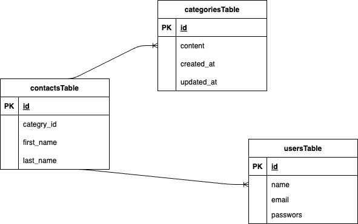

# アプリケーション名
- お問い合わせフォーム
## 環境構築
```

リポジトリからダウンロードして下さい  
git clone   

srcディレクトリに.envファイルを作成し  
docker-compose.ymlのDBの設定を記入して下さい  
$ cp .env.example .env  
---  
DB_HOST=XXX  
DB_DATABASE=XXX  
DB_USERNAME=XXX  
DB_PASSWORD=XXX  
---

dockerコンテナを構築して下さい
$ docker-compose up -d --build
$ docker-compose exec php bash
> composer install
> php artisan key:generate
> php artisan migrate
> php artisan db:seed

http://localhostにアクセスして
"The stream or file could not be opened"というエラーが発生した場合は
ファイルの権限を変更して対応お願いします
```

## 使用技術(実行環境)
- Laravel 8.83.8
  PHP 7.4.9
  mysql 8.0.29

## ER図
< - - - 作成したER図の画像 - - - >
- 


## URL
- 開発環境:http://localhost/
  phpMyadmin:http://localhost:8080/
